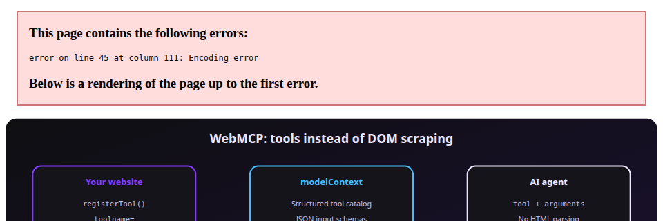
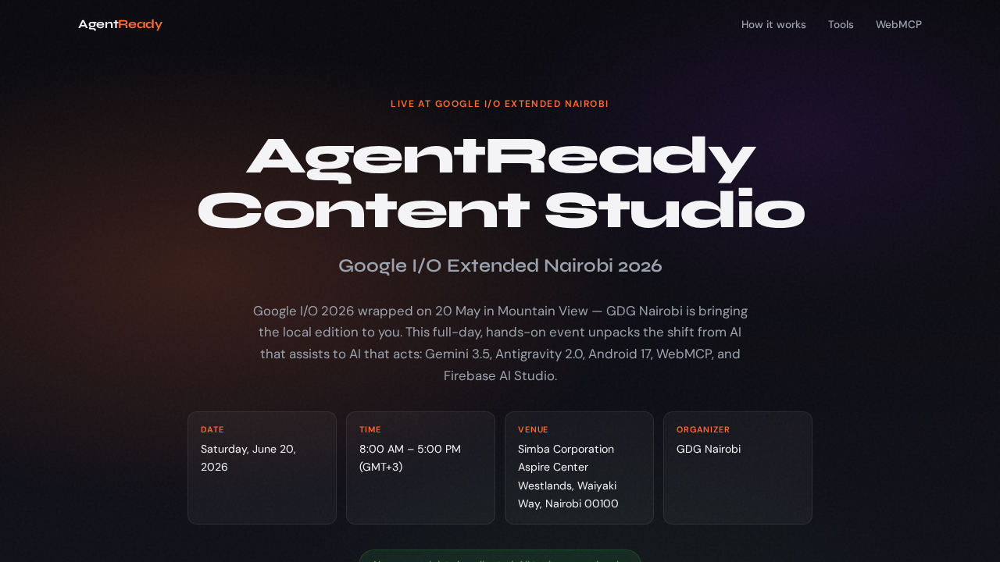
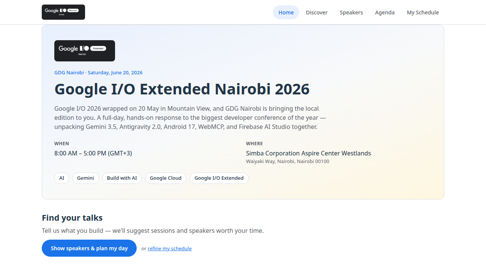
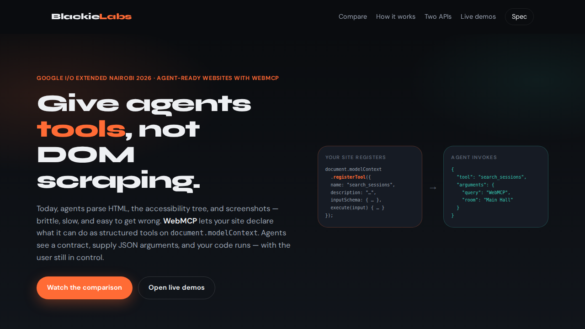

# GDG Nairobi · WebMCP Demos

Hands-on demos for **Google I/O Extended Nairobi 2026** — showing how websites can expose structured tools to AI agents with [WebMCP](https://github.com/webmachinelearning/webmcp) instead of brittle DOM scraping.

Built for the GDG Nairobi community around Gemini, Antigravity, Android 17, Firebase AI Studio, and agent-ready web development.

**Repository:** [github.com/Blackie360/gdgnai-web-mcp](https://github.com/Blackie360/gdgnai-web-mcp)



## Live demos

| Demo | API style | URL |
|------|-----------|-----|
| AgentReady Content Studio | Declarative (`toolname`, `toolparamdescription`) | [symphonious-babka-2aa577.netlify.app](https://symphonious-babka-2aa577.netlify.app/) |
| GDG Event Guide | Imperative (`registerTool`) | [travel-webmcp-demo.vercel.app](https://travel-webmcp-demo.vercel.app/) |
| Blackie Labs explainer | Teaching / overview | [webmcp.cursorkenya.com](https://webmcp.cursorkenya.com) |

<p align="center">
  <a href="https://symphonious-babka-2aa577.netlify.app/"></a>
  <a href="https://travel-webmcp-demo.vercel.app/"></a>
</p>

## Repository layout

```
gdgnai-web-mcp/
├── mcp-formlab/              # Blackie Labs — WebMCP explainer (vanilla HTML)
├── webmcp_declarative/       # AgentReady Content Studio — declarative forms
├── gdgspeakersearch web mcp/ # GDG Event Guide — imperative agent tools (React)
└── docs/images/              # README screenshots and diagrams
```

## Two ways to make a site agent-ready

| | Declarative API | Imperative API |
|---|-----------------|----------------|
| **Where** | HTML form attributes | JavaScript `registerTool()` |
| **Best for** | Forms, wizards, content generation | SPA navigation, filters, dynamic UI |
| **Demo in this repo** | [webmcp_declarative/](./webmcp_declarative/) | [gdgspeakersearch web mcp/](./gdgspeakersearch%20web%20mcp/) |

Both attach to `document.modelContext` / `navigator.modelContext` so agents receive structured JSON schemas instead of guessing from the DOM.

---

## Projects

### mcp-formlab — Blackie Labs explainer

Side-by-side **Without WebMCP vs With WebMCP** walkthrough, imperative vs declarative API overview, presenter script, and links to live demos. No build step.

**Live:** [webmcp.cursorkenya.com](https://webmcp.cursorkenya.com)

[](https://webmcp.cursorkenya.com)

**The core idea** — register a tool, agent invokes with JSON:

```javascript
document.modelContext.registerTool({
  name: 'search_sessions',
  description: 'Find agenda sessions by query, speaker, or room.',
  inputSchema: {
    type: 'object',
    properties: {
      query: { type: 'string' },
      room: { type: 'string' },
    },
  },
  execute(input) {
    return { sessions: searchAgenda(input) }
  },
})
```

Agent invocation:

```json
{
  "tool": "search_sessions",
  "arguments": {
    "query": "WebMCP",
    "room": "Main Hall"
  }
}
```

```bash
python3 -m http.server 8080 --directory mcp-formlab
```

Open http://localhost:8080

→ [mcp-formlab/README.md](./mcp-formlab/README.md)

---

### webmcp_declarative — AgentReady Content Studio

Declarative WebMCP forms for event content: social posts, speaker intros, session summaries, and more. No JavaScript registration — the browser discovers tools from HTML attributes.

**Declarative form** (`webmcp_declarative/index.html`):

```html
<form
  id="form-generate_event_post"
  toolname="generate_event_post"
  tooldescription="Generates a social media draft using public Google I/O Extended Nairobi 2026 event information."
  novalidate
>
  <label for="f1-platform">Platform</label>
  <select
    id="f1-platform"
    name="platform"
    toolparamdescription="Target social platform for the draft post."
  >
    <option value="X">X</option>
    <option value="LinkedIn" selected>LinkedIn</option>
    <option value="WhatsApp">WhatsApp</option>
  </select>

  <label for="f1-tone">Tone</label>
  <select
    id="f1-tone"
    name="tone"
    toolparamdescription="Desired tone for the generated post."
  >
    <option value="professional" selected>professional</option>
    <option value="excited">excited</option>
  </select>
</form>
```

When an agent activates the tool, the browser fills fields from `toolparamdescription` hints and returns form output — with the user still able to review before submit.

```bash
python3 -m http.server 8080 --directory webmcp_declarative
```

→ [webmcp_declarative/README.md](./webmcp_declarative/README.md)

---

### gdgspeakersearch web mcp — GDG Event Guide

React + Vite app for **Google I/O Extended Nairobi 2026**. Registers imperative tools via `navigator.modelContext.registerTool()` so agents can browse speakers, explore the agenda, set interests, build a schedule, and navigate the UI.

**Register all event tools** (`gdgspeakersearch web mcp/src/webmcp.ts`):

```typescript
export function registerEventTools() {
  const modelContext = document.modelContext || navigator.modelContext
  if (!modelContext || toolsState.controller) return

  toolsState.controller = new AbortController()
  const options = { signal: toolsState.controller.signal }

  modelContext.registerTool(listSpeakersTool, options)
  modelContext.registerTool(listSessionsAndShowTool, options)
  modelContext.registerTool(suggestSessionsTool, options)
  modelContext.registerTool(navigateToTool, options)
  modelContext.registerTool(buildMyScheduleTool, options)
  modelContext.registerTool(showFullAgendaTool, options)
  modelContext.registerTool(setInterestsTool, options)
  modelContext.registerTool(getSessionDetailsTool, options)
}
```

**Example tool definition** — interest-based session suggestions that also update the UI:

```typescript
export const suggestSessionsTool = {
  execute: (input: Record<string, unknown>) => suggestSessions(input),
  name: 'suggestSessions',
  description:
    'Suggest sessions and speakers based on interests. Updates on-screen highlights for matching talks.',
  inputSchema: {
    type: 'object',
    properties: {
      interests: {
        type: 'array',
        items: { type: 'string', enum: VALID_INTERESTS },
      },
    },
  },
  outputSchema: { type: 'object' },
  annotations: { readOnlyHint: true },
}
```

**Tools:** `listSpeakers`, `listSessions`, `suggestSessions`, `setInterests`, `navigateTo`, `buildMySchedule`, `showFullAgenda`, `getSessionDetails`

```bash
cd "gdgspeakersearch web mcp"
npm install
npm run dev
```

→ [gdgspeakersearch web mcp/README.md](./gdgspeakersearch%20web%20mcp/README.md)

## Event details

**Google I/O Extended Nairobi 2026**

- **Date:** Saturday, June 20, 2026
- **Time:** 8:00 AM – 5:00 PM (GMT+3)
- **Venue:** Simba Corporation Aspire Center Westlands, Nairobi
- **Organizer:** [GDG Nairobi](https://gdg.community.dev/gdg-nairobi/)

## Resources

- [WebMCP specification](https://github.com/webmachinelearning/webmcp)
- [Chrome Labs WebMCP demos](https://googlechromelabs.github.io/webmcp-tools/)
- [Google I/O Extended Nairobi 2026 on GDG Community](https://gdg.community.dev/events/details/google-gdg-nairobi-presents-google-io-extended-nairobi-2026/)

## License

Demo code in `gdgspeakersearch web mcp/` is licensed under Apache-2.0. See subfolder READMEs for other project details.
